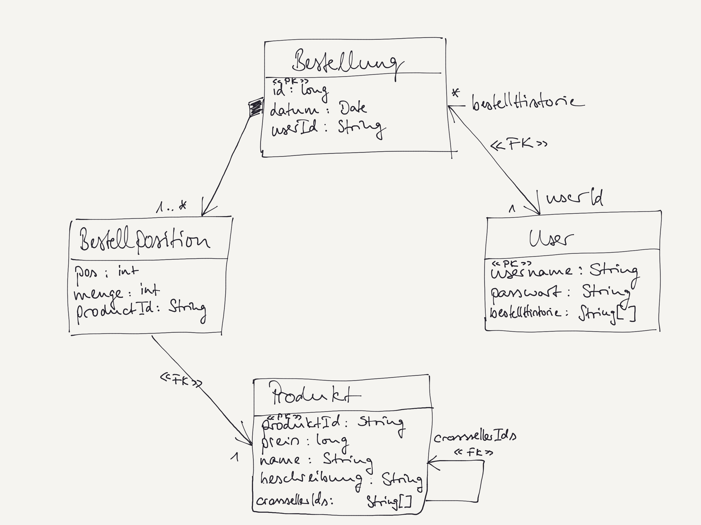

# Vorbereitung Microservices

## Kontext
Sie sind als Softwarearchitekt:in beauftragt, das Software- und Servicedesign 
für einen Online-Shop zu übernehmen.
Aus einem ersten Treffen mit dem Unternehmen haben Sie folgende Skizze eines Teils des Domänenmodells vorliegen:

## Aufgabe: Servicedesign und Microservices

Beantworten Sie folgende Fragen: 

- Welche Services würden Sie hier vorschlagen? 
- Ist das Microservice-Paradigma hier anwendbar und sinnvoll (Begründung)? 
- Falls sinnvoll: Was würde hier "polyglotte Programmierung/Implementierung" und "polyglotte Datenhaltung" konkret bedeuten?

## Aufgabe: Implementierung der Service-API und des/der Services

Nutzen Sie gRPC und Hazelcast als Technologiestack für die API bzw. für die Datenspeicherung, 
damit in einem ersten MVP-Prototypen *Bestellungen* aufgegeben (und gespeichert), gelistet und gelöscht werden können.

Beantworten Sie folgende Fragen und implementieren Sie entsprechend:

- Wie muss die `.proto`-Datei aussehen? (In einem Verzeichnis `src/main/proto/`.)
- Welche Hazelcast-Datenstrukturen nutzen Sie für welche Entitäten bzw. Aggregate und wie nennen Sie diese?

## Aufgabe: Anwendung des MapReduce-Algorithmus

Wenden Sie mit Hilfe von Hazelcast den MapReduce-Algorithmus an, um folgende Aufgabenstellung umzusetzen:

Für alle Produkte (sofern das für alle möglich ist) sollen jeweils die (maximal) drei Top-Crossseller-Produkte ermittelt werden. 
Das sind alle Produkte, die Kunden schon mal zusammen mit anderen Produkten gekauft haben.

Setzen Sie dies als MapReduce-Job auf. Dieser Job soll von außen über eine entsprechende "Adminschnittstelle" gestartet werden können.

## Aufgabe: Anwendung mehrerer Service-APIs

Beantworten Sie folgende Frage zunächst theoretisch:

- Ist es möglich, dass obiger Service über verschiedene Schnittstelltechnologien aufgerufen werden kann?

Falls dies Ihrer Meinung nach möglich ist:

- Beschreiben Sie für alle Ihnen aus der Vorlesung bekannten Schnittstellentechnologien, was Sie hier wie machen müssten.

Falls dies Ihrer Meinung nach nicht möglich ist:

- Begründen Sie (jeweils), warum das nicht möglich ist.

